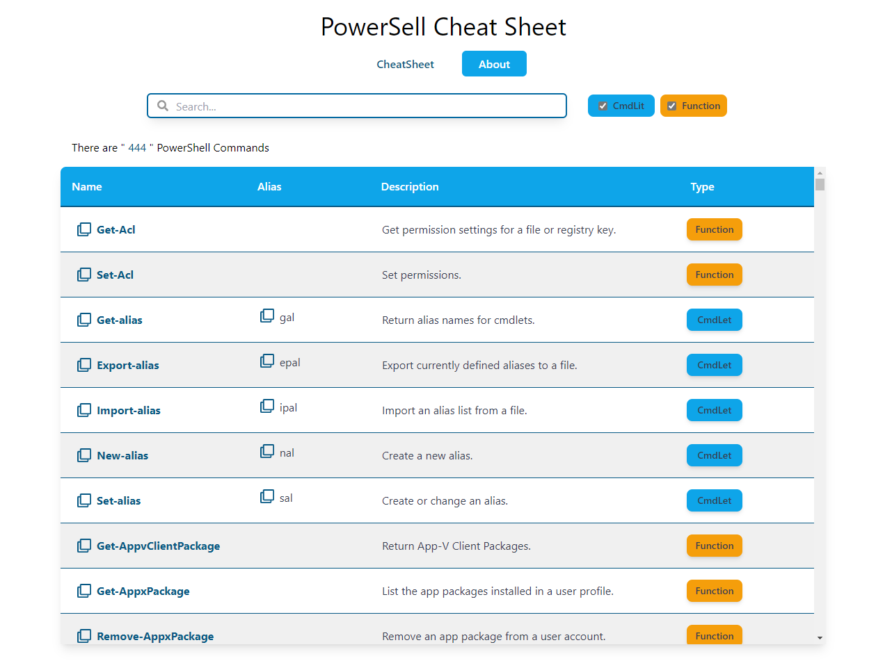
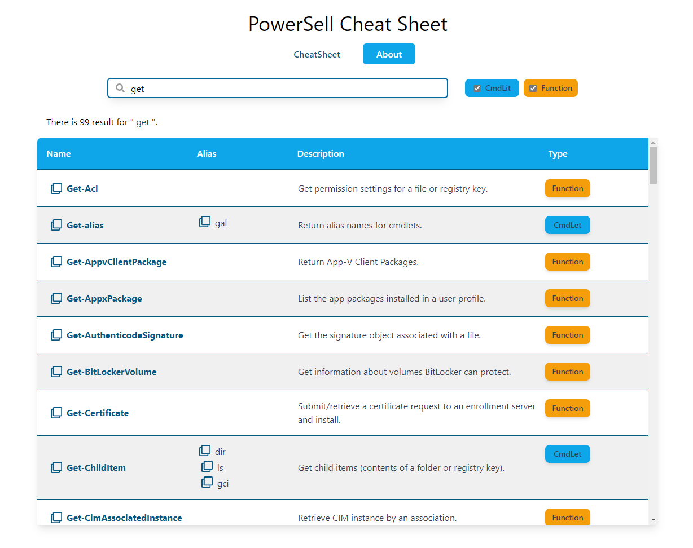
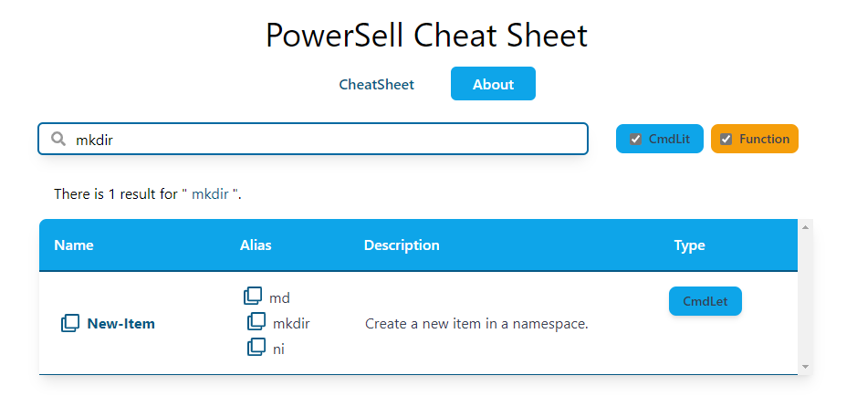
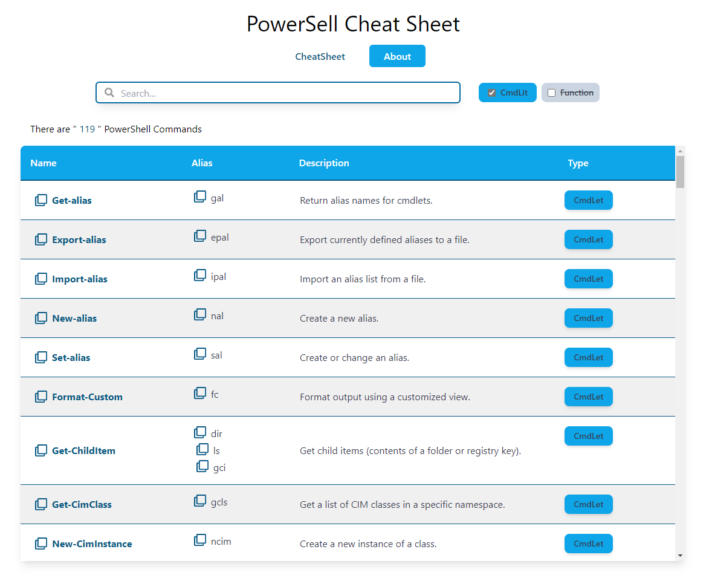
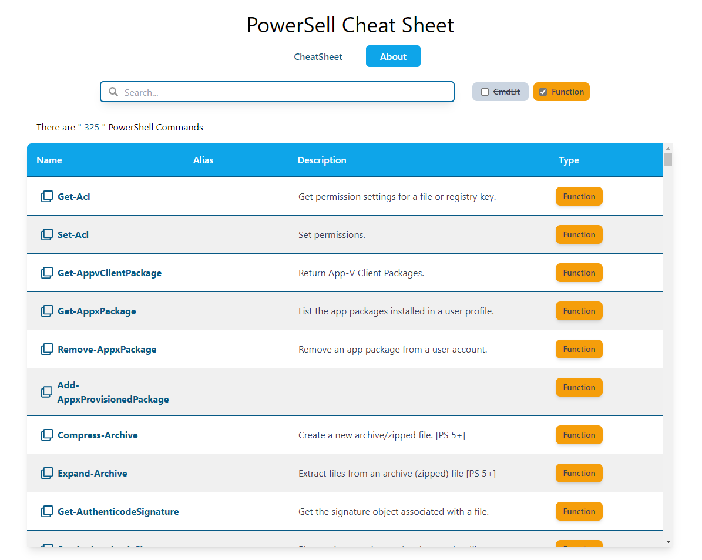

# PowerShell Cheat Sheet:

PSCheatSheet is a Web App made with React, it features a list of **400+ PowerShell command** as well as short description and it cmdlet and also the type of the command, you can _search_ by _command name_ or _cmdlet_ while searching you can _filter_ the result using _options_ on the top right side, on _clicking_ on any command name you'll be redirected to another page to see in dept description with examples for different parameters.

**This Project was made to help student learn powershell commands in one place.**

### How to run:

See live demo [Click here.](https://pscheatsheet.netlify.app)

1. Clone the repo `git clone https://github.com/ayoubmazouz/powershell-cheat-sheet`
1. Navigate to powershell-cheat-sheet folder and run `npm start`
1. Visit `https://localhost:3000`

### ScreenShots:

